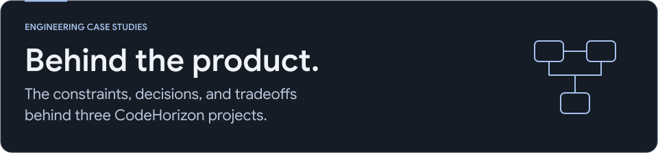

<picture>
  <source media="(max-width: 767px) and (prefers-color-scheme: dark)" srcset="assets/index-mobile-dark.svg">
  <source media="(max-width: 767px) and (prefers-color-scheme: light)" srcset="assets/index-mobile-light.svg">
  <source media="(prefers-color-scheme: dark)" srcset="assets/index-dark.svg">
  <source media="(prefers-color-scheme: light)" srcset="assets/index-light.svg">
  
</picture>

I'm [Yuvaraj Vodiboina](https://yuvarajvodiboina.in/), an independent software engineer building web products, Chrome extensions, and Android apps at [CodeHorizon](https://codehorizon.in/).

These notes explain problems I encountered, the decisions I made, and how I checked the implementation. **Application source remains private.** This repository contains documentation and public product images.

## Selected case studies

| Project | The engineering problem | Status |
| :--- | :--- | :--- |
| **[ShopGrade](case-studies/shopgrade.md)** | A lost response must not turn an audit retry into another credit charge. | Released on the Chrome Web Store |
| **[SecureVault](case-studies/securevault.md)** | File previews and failed imports need an explicit plaintext cleanup lifecycle. | Released on Google Play |
| **[Nicked](case-studies/nicked.md)** | Daily answers and saved progress must remain consistent as the player dataset changes. | In testing |

Each page includes a small architecture diagram, product visuals, implementation decisions, tradeoffs, and the scope of the verification evidence. I distinguish checks run for these notes from tests reviewed in the projects.

## Public code and community work

[AxionAOSP for Xiaomi Pad 6](https://github.com/yuvarajvodiboina/axion-pipa) · [Chat Room](https://github.com/yuvarajvodiboina/Chat_Room) · [IdentiFlash](https://github.com/yuvarajvodiboina/identi_flash)

For the wider collection: [GitHub profile](https://github.com/yuvarajvodiboina) · [Product catalogue](https://codehorizon.in/products/) · [Release history](https://codehorizon.in/changelog/).

Last reviewed: 4 October 2026. Screenshots come from the public CodeHorizon product galleries; [media sources](assets/MEDIA-SOURCES.md). Header lettering uses Google Sans with the included font license.
