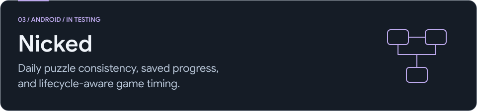
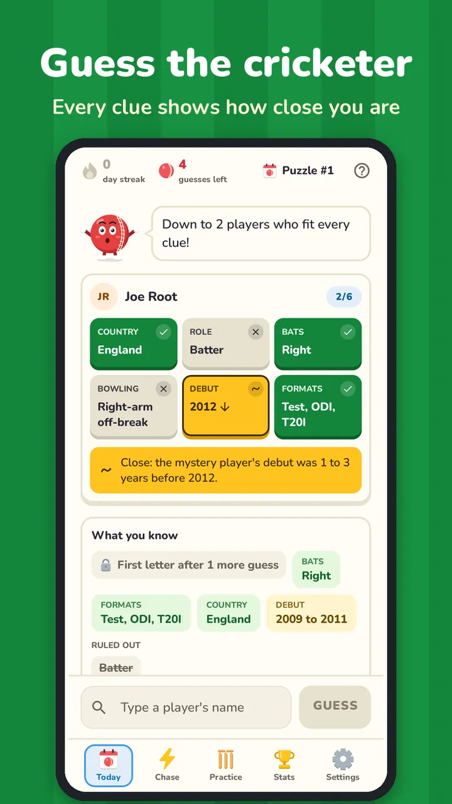
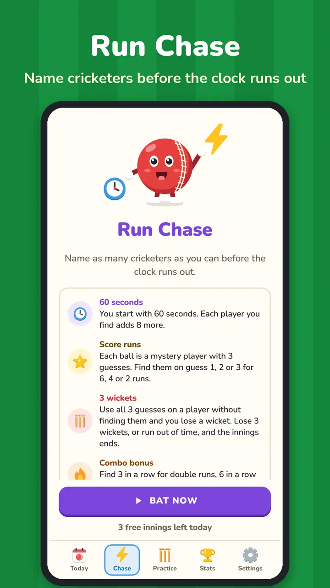
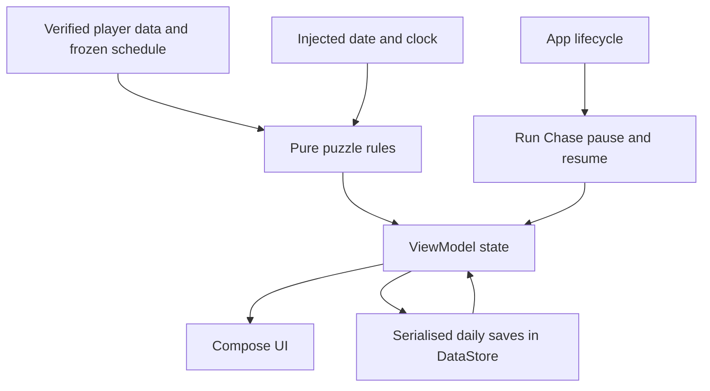

<picture>
  <source media="(max-width: 767px) and (prefers-color-scheme: dark)" srcset="../assets/nicked-mobile-dark.svg">
  <source media="(max-width: 767px) and (prefers-color-scheme: light)" srcset="../assets/nicked-mobile-light.svg">
  <source media="(prefers-color-scheme: dark)" srcset="../assets/nicked-dark.svg">
  <source media="(prefers-color-scheme: light)" srcset="../assets/nicked-light.svg">
  
</picture>

[All case studies](../README.md) / [Product](https://codehorizon.in/products/nicked/) / [Trailer](https://youtu.be/oFikiJFPoco)

**My role:** Independent Android product developer, covering game rules, Compose UI, persistence, and lifecycle behaviour.  
**Stack:** Kotlin, Jetpack Compose, DataStore, SavedStateHandle. **Status:** In testing. Application source remains private.

Nicked is a cricket guessing game with a daily puzzle, attribute clues, saved progress, and a timed Run Chase mode.

  
  

## The problem I had to solve

A seeded shuffle seems sufficient for a daily puzzle until the candidate dataset changes. Adding players can change the entire sequence and make two app versions disagree about the same puzzle. Restoring a game by recalculating today's answer can also change an unfinished round. Meanwhile, fast guesses can launch saves that finish out of order.

## Architecture

## Decisions and tradeoffs

**Freeze the published order.** Existing scheduled player IDs stay at the head of the sequence; missing candidates are appended in a deterministic order. I use an explicit SplitMix64 generator and Fisher-Yates shuffle so a Kotlin runtime update does not redefine the sequence. Dataset changes need to preserve previously scheduled IDs as well as the schedule.

**Persist the round's identity.** Daily saves include the puzzle number, answer ID, guesses, and clue usage. Restoring reads that answer ID instead of deriving a new answer from the latest dataset. Query and selection state use SavedStateHandle, while durable game progress uses DataStore.

**Serialize saves before announcing results.** A mutex protects save operations, and each save reads the current game state. The finish event is emitted after game and statistics persistence, so the result screen does not race a pending write.

**Give the two modes different lifetimes.** The daily puzzle checks the device's local calendar date on resume and at midnight rollover. Run Chase uses elapsed realtime for timing, pauses while backgrounded, and resets its tick reference on resume. A short Run Chase innings is deliberately not persisted midway; completed records are saved.

## Verification and boundaries

I reviewed existing tests for deterministic scheduling, append-only additions, process-death restoration, midnight rollover, scoring, and timed innings. Time and game dependencies are injectable so those cases can be tested without waiting for the real clock. I did not run the Android test suite during this case-study review.

The daily boundary follows the device's local timezone. It does not imply one simultaneous global reset or protection against device-clock changes. Release validation still needs device testing across background/resume transitions and dataset upgrades.

**What this project taught me:** A daily game's answer is versioned product data. Persistence must preserve the player's round, not merely reproduce today's calculation.

Reviewed 4 October 2026. [Public image sources](../assets/MEDIA-SOURCES.md).
