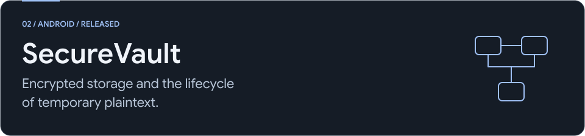
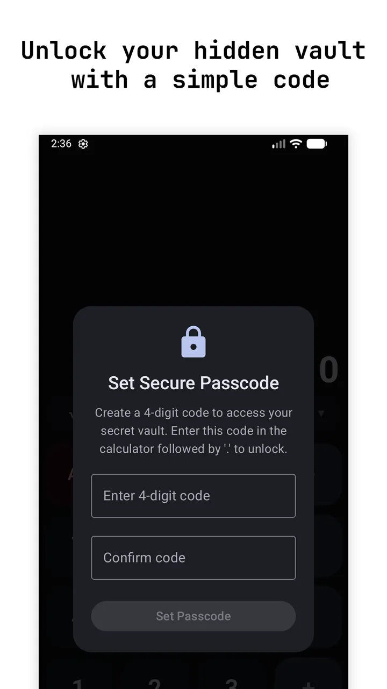
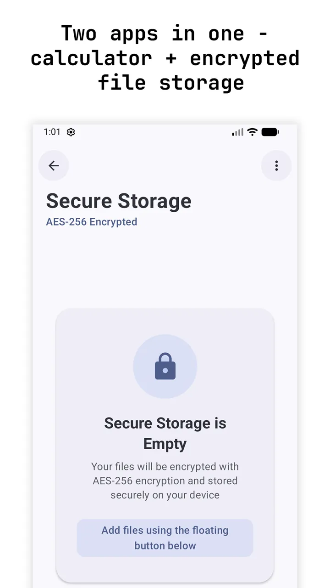
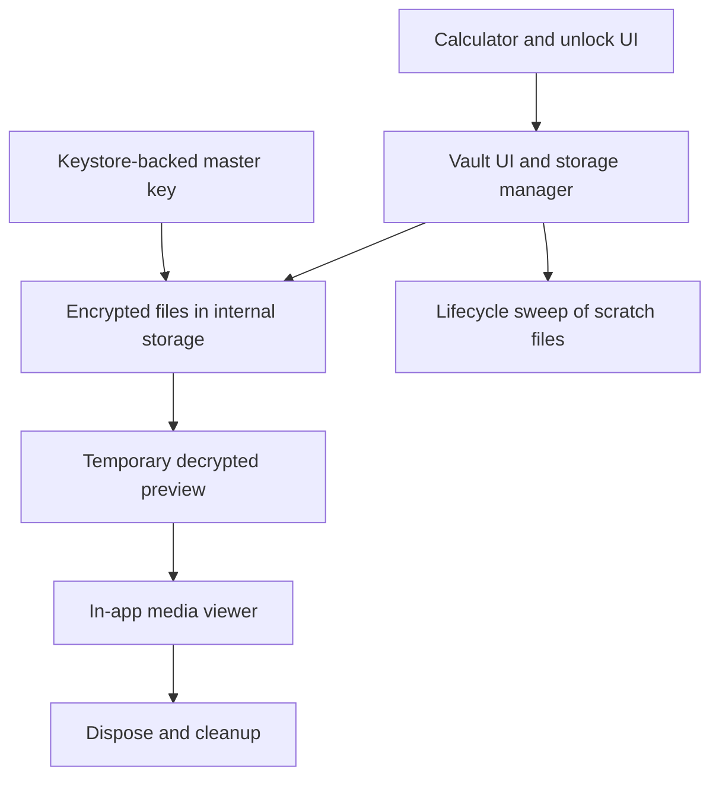

<picture>
  <source media="(max-width: 767px) and (prefers-color-scheme: dark)" srcset="../assets/securevault-mobile-dark.svg">
  <source media="(max-width: 767px) and (prefers-color-scheme: light)" srcset="../assets/securevault-mobile-light.svg">
  <source media="(prefers-color-scheme: dark)" srcset="../assets/securevault-dark.svg">
  <source media="(prefers-color-scheme: light)" srcset="../assets/securevault-light.svg">
  
</picture>

[All case studies](../README.md) / [Product](https://codehorizon.in/products/securevault/) / [Google Play](https://play.google.com/store/apps/details?id=com.codehorizon.calculator)

**My role:** Independent Android product developer, covering the Compose interface, file storage, security flows, and release work.  
**Stack:** Kotlin, Jetpack Compose, Android Keystore, Android Security EncryptedFile. **Status:** Released. Application source remains private.

SecureVault combines a working calculator with a local file vault, passcode and biometric access, and inactivity locking.

  
  

## The problem I had to solve

Encryption protects stored files, but a media preview still needs readable content. Notes, camera captures, and imports can also create plaintext before encryption. If cleanup runs only on success, an exception can leave a readable file in cache. Android process termination also makes JVM exit hooks an unreliable cleanup strategy.

## Architecture

## Decisions and tradeoffs

**Use the platform encryption primitives.** File content uses Android Security's authenticated AES-256-GCM file encryption with a Keystore-backed master key. Biometric and passcode checks gate application access. I keep those claims separate: an unlock screen is not itself the encryption mechanism.

**Give plaintext a defined lifecycle.** I centralised scratch files in a dedicated cache directory. Note creation and reading use cleanup in `finally`; a failed decryption deletes its partial output. The in-app viewer deletes its temporary file when it leaves composition, and activity-stop cleanup sweeps leftovers, including older scratch-file patterns.

**Use a stable internal vault location.** I moved vault storage into the app's internal directory with migration from the previous location. Choosing between external and internal storage based on availability could otherwise point a later launch at a different vault. Internal storage also reduces exposure of the vault directory listing through ordinary USB file browsing. If migration is incomplete, the app keeps using the legacy location and retries later to avoid showing an apparently empty vault.

**Prefer a contained viewer.** Keeping media preview inside the app gives the app a clear point to release the player and remove the preview file. Sharing a decrypted file intentionally crosses that boundary, so encryption at rest does not imply that shared or currently viewed content remains encrypted.

## Verification and boundaries

For these notes, I reviewed the encryption, migration, scratch-file, viewer-disposal, and activity-lifecycle cleanup paths. Existing unit tests cover navigation tracking and security-setting defaults. I did not run Android unit or device tests for this case-study review.

The next useful device checks are interrupted imports, corrupted-file previews, process termination during viewing, and legacy-storage migration. There is no independent security-audit claim here. Cleanup is ordinary file deletion; it is not a guarantee of physical secure erasure on flash storage.

**What this project taught me:** The lifetime of readable data matters as much as the encrypted format. Exceptions, lifecycle transitions, and migration all belong in the storage design.

Reviewed 4 October 2026. [Public image sources](../assets/MEDIA-SOURCES.md).
