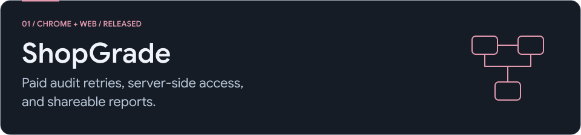
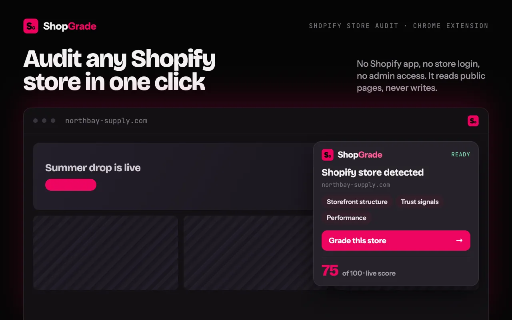
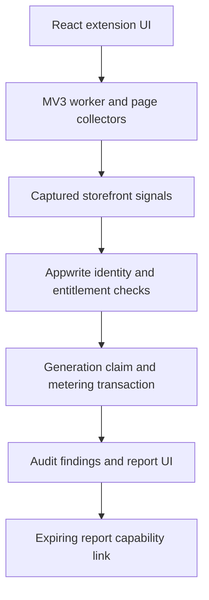
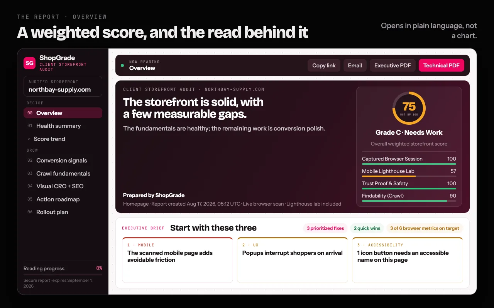

<picture>
  <source media="(max-width: 767px) and (prefers-color-scheme: dark)" srcset="../assets/shopgrade-mobile-dark.svg">
  <source media="(max-width: 767px) and (prefers-color-scheme: light)" srcset="../assets/shopgrade-mobile-light.svg">
  <source media="(prefers-color-scheme: dark)" srcset="../assets/shopgrade-dark.svg">
  <source media="(prefers-color-scheme: light)" srcset="../assets/shopgrade-light.svg">
  
</picture>

[All case studies](../README.md) / [Product](https://codehorizon.in/products/shopgrade/) / [Chrome Web Store](https://chromewebstore.google.com/detail/shopgrade/aenccbnkkimncdjikjgapconaegnmbeo)

**My role:** Independent product developer, covering interface design, extension integration, backend functions, and release work.  
**Stack:** React, TypeScript, Chrome Manifest V3, Appwrite. **Status:** Released. Application source remains private.

ShopGrade audits public Shopify storefronts and turns captured signals into prioritised findings and reports. It does not require store admin access.

## The problem I had to solve

A paid audit crosses several boundaries: the extension, server-side usage limits, report access, and generation. If the server commits a credit spend but its response is lost, a retry can look like a fresh request. Recording the request only after charging also leaves room for concurrent requests to charge twice.

## Architecture

## Decisions and tradeoffs

**Bind retries to the report.** I reserve a server-side generation claim before metering. Its key combines the generation request with a report fingerprint, so reusing a request ID for different report content cannot silently reuse the original entitlement.

**Make the paid state change atomic.** Credit decrement, report entitlement, and the final claim outcome are staged in one transaction. An uncertain commit response is treated as ambiguous. The recovery path resolves the existing claim rather than blindly repeating the writes. This adds recovery logic, but avoids treating a timeout as proof that nothing happened.

**Keep access decisions on the server.** The backend checks identity, plan allowance, and purchased credits. Client-side flags make the interface responsive; they do not grant paid access.

**Share reports with bounded access.** A report link carries a random 256-bit token; the stored access credential is its SHA-256 digest. Links expire after 15 days and support owner revocation. A recipient does not need an account, but anyone holding a valid link can use it until expiry or revocation.

View the report presentation

## Verification and boundaries

On 4 October 2026, I ran **11 existing unit tests** against the report-link and generation-claim-key helpers. All passed. They cover token shape and hashing, expiry, deterministic publication IDs, claim separation, and legacy claim matching.

The transaction and recovery paths were reviewed in the implementation. These helper results do not establish end-to-end billing correctness or a passing full application suite. Public storefront signals also cannot establish conversion uplift; the findings are inputs for investigation.

**What this project taught me:** A retry needs an identity and a recovery rule. A database transaction alone cannot tell a caller what happened when the response never arrives.

Reviewed 4 October 2026. [Public image sources](../assets/MEDIA-SOURCES.md).
